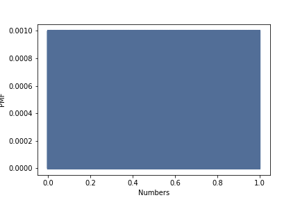
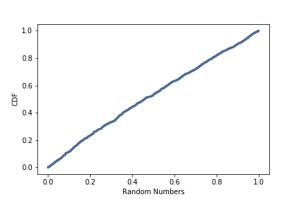

[Think Stats Chapter 4 Exercise 2](http://greenteapress.com/thinkstats2/html/thinkstats2005.html#toc41) (a random distribution)

### Question
The numbers generated by numpy.random.random are supposed to be uniform between 0 and 1; that is, every value in the range should have the same probability.

Generate 1000 numbers from numpy.random.random and plot their PMF. What goes wrong?

Now plot the CDF. Is the distribution uniform?

### Answer

```python
%matplotlib inline

import numpy as np
import thinkstats2
import thinkplot
import matplotlib
import matplotlib.pyplot as plt

numbers = np.random.random(1000)
pmf = thinkstats2.Pmf(numbers)
thinkplot.Pmf(pmf)
thinkplot.Config(xlabel='Random Numbers', ylabel='PMF')
plt.savefig('pmf.png')
```



The probability mass function (PMF) above shows that every number from 0 to 1 has nearly the exact same probability of being selected by np.random.random

```python
cdf = thinkstats2.Cdf(numbers)
thinkplot.Cdf(cdf)
thinkplot.Config(xlabel='Random Numbers', ylabel='CDF')
plt.savefig('cdf.png')
```


The cumulative distribution function (CDF) above shows an approximately straight line, meaning the distribution is uniform.
